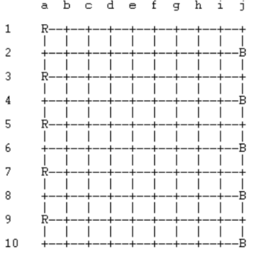
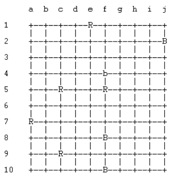
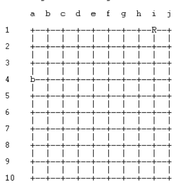

# PFL - TP2
### Grupo: SkiJumps_6
### Trabalho realizado por:
 - João Francisco Ferreira Maldonado - up202004244 (50%)
 - Tomás Pereira Matos Gomes - up202004393 (50%)
 
 ### Instalação e execução
 > Para a utilização do jogo, além da instalação do SICStus Prolog 4.7.1, é necessário consultar o ficheiro 'main.pl'.
 > De seguida, para começar o jogo, apenas necessitamos invocar o predicado 'play/0'.

### Descrição Sumária
> Ski Jumps é um jogo de tabuleiro que simula a modalidade de saltos de ski. 
> O objetivo do jogo é sermos o último jogador a mover-se. Para tal, ambos os jogadores jogam à vez, podendo mover as peças horizontalmente o número de casas que desejarem. As peças vermelhas andam para a direita e as pretas para a esquerda. Apenas as peças 'red_jumper' e 'black_jumper' podem andar verticalmente, sendo que podem saltar por cima de uma peça adjacente desde que haja uma casa vazia imediatamente abaixo ou acima (consoante a direção do salto). Ao saltar por cima de uma peça esta passa a ser do tipo 'slipper', mantendo a cor.
> Fontes: https://www.di.fc.ul.pt/~jpn/gv/skijump.htm, https://annarchive.com/files/Winning%20Ways%20for%20Your%20Mathematical%20Plays%20V1.pdf (págs. 28 e 29)

### Representação interna
> A representação interna do tabuleiro é feita através de uma lista de listas, onde cada elemento representa uma posição do tabuleiro. As peças são representadas por símbolos, como 'red' para os 'slippers' vermelhos, 'black' para os 'slippers pretos, 'red_jumper' para os saltadores vermelhos e 'black_jumper' para os saltadores pretos. O símbolo 'empty' é usado para representar posições vazias no tabuleiro.
> Para representar o jogador atual é utilizado o predicado current_player(-Player). Para alternar este predicado é feito o retract e o assert do mesmo com os valores que o 'Player' pode tomar (red ou black). 
> #### Initial state 
>``` [[red_jumper, empty, empty, empty, empty, empty, empty, empty, empty, empty],[empty, empty, empty, empty,empty,empty, empty, empty, empty, black_jumper],[red_jumper, empty, empty, empty, empty, empty, empty, empty, empty, empty],[empty, empty, empty, empty,empty, empty, empty, empty, empty,black_jumper],[red_jumper, empty, empty, empty, empty, empty, empty, empty, empty, empty],[empty, empty, empty, empty, empty, empty, empty, empty, empty, black_jumper],[red_jumper, empty, empty, empty, empty, empty, empty, empty, empty, empty],[empty, empty, empty, empty, empty, empty, empty, empty, empty, black_jumper],[red_jumper, empty, empty, empty, empty, empty, empty, empty, empty,empty],[empty, empty, empty, empty, empty, empty, empty, empty, empty, black_jumper]]  ```
>
>


>  #### Intermediate state 
>  ``` [[empty, empty, empty, empty, red_jumper, empty, empty, empty, empty, empty],[empty, empty, empty, empty,empty,empty, empty, empty, empty, black_jumper],[empty, empty, empty, empty, empty, empty, empty, empty, empty, empty],[empty, empty, empty, empty,empty, black, empty, empty, empty,empty],[empty, empty, red_jumper, empty, empty, red_jumper, empty, empty, empty, empty],[empty, empty, empty, empty, empty, empty, empty, empty, empty, empty],[red_jumper, empty, empty, empty, empty, empty, empty, empty, empty, empty],[empty, empty, empty, empty, empty, black_jumper, empty, empty, empty, empty],[empty, empty, red_jumper, empty, empty, empty, empty, empty, empty,empty],[empty, empty, empty, empty, empty, black_jumper, empty, empty, empty, empty]] ``` 
>
>

> #### Final state
> ``` [[empty, empty, empty, empty, empty, empty, empty, empty, red_jumper, empty],[empty, empty, empty, empty,empty,empty, empty, empty, empty, empty],[black, empty, empty, empty,empty, empty, empty, empty, empty,empty],[empty, empty, empty, empty, empty, empty, empty, empty, empty, empty],[empty, empty, empty, empty, empty, empty, empty, empty, empty, empty],[empty, empty, empty, empty, empty, empty, empty, empty, empty, empty],[empty, empty, empty, empty, empty, empty, empty, empty, empty, empty],[empty, empty, empty, empty, empty, empty, empty, empty, empty,empty],[empty, empty, empty, empty, empty, empty, empty, empty, empty, empty]] ``` 
>
>

### Visualização do estado de jogo
> A visualização está dividida em duas partes: menu e jogo. Na parte de visualização do menu são apresentadas as 4 opções (Humano vs Humano, Humano vs Computador, Computador vs Computador, Sair). Dentro da opção 'Humano vs Computador' é possível escolher a dificuldade do computador. Ao nível do jogo a cada jogada é apresentado o tabuleiro, usando o predicado **display_game(+Board)**, e, se for uma jogada feita por um humano, é pedido ao utilizador que escolha a peça que deseja mover, sendo primeiro pedida a linha e depois a coluna. Se for uma peça que pertença ao utilizador e que tenha ainda movimentos possíveis são apresentados ao utilizador estes movimentos e é pedido para ser feita a escolha de um destes. É feita a validação dos dados inseridos em todos os momentos de I/O e é dado o devido feedback ao utilizador.

### Execução de jogadas
> A execução de uma jogada é feita através do predicado **make_move(+Board, +Player,+OldRow, +OldCol, +NewRow, +NewCol, +NewBoard)**, este predicado recebe o tabuleiro atual, o jogador, as coordenadas originais da peça e as coordenadas de destino e retorna o tabuleiro alterado no último parâmetro. Este predicado apenas executa a alteração pedida, a validação da jogada é feita no momento em que é pedido o input do utilizador. Existe a possibilidade de um jogador se mover para fora do tabuleiro, sendo que essas jogadas são apresentadas ao utilizador como '(Linha, z)'.

### Lista de jogadas válidas
> Para serem mostradas as jogadas válidas ao utilizador é utilizado o predicado **valid_moves(+Board, +Player, -Moves)** que percorre todas as peças de um Player, valor que é passado como 2º argumento, e junta numa lista de pares, guardada na variável Moves, todos as casas de destino possíveis. Este predicado utiliza dois predicados distintos, devido à existência de dois tipos de peças com movimentos diferentes: **valid_jumper_moves(+Board, +Player, +Row, +Col, -Moves)** e **valid_slipper_moves(+Board, +Player, +Row, +Col, -Moves)**, têm um funcionamento semelhante na medida em que retornam na variável Moves uma lista de pares com as coordenadas de destino de todas as jogadas da peça na posição dada; o que os distingue é o facto do valid_jumper_moves fazer a verificação de movimentos verticais.

### Final do Jogo
> Durante o ciclo do jogo, antes de qualquer jogada, é feita a verificação de que ambos os jogadores possuem pelo menos esta jogada. Para isto utilizamos o predicado **game_over(+Board)** que falha se o jogo puder continuar e tem sucesso caso o jogo acabe. Ao se verificar o fim o predicado imprime a mensagem de 'Game Over' e o vencedor, terminando o ciclo de jogo.

### Avaliação do Tabuleiro
> Para a avaliação do tabuleiro foi criado o predicado **value(+Board, +Player, -Value)**. Neste predicado são contadas as jogadas que ambos os utilizadores têm e também o número de peças do tipo 'jumper' do adversário. Na variável Value é armazenado o resultado de: nossas_jogadas - jogadas_adversário - 2 * n_jumpers_adversário. A avaliação é feita desta forma devido ao objetivo do jogo consistir em preservar o maior número de jogadas.

### Jogada do Computador
> Para o computador escolher a jogada que irá executar é utilizado o predicado **choose_cpu_move(+Board, +Player, +Level, -NewBoard)**. Se o Level tiver o valor 1 será escolhida uma peça aleatoriamente e dessa peça será escolhida uma jogada também aleatoriamente. Se o Level tiver o valor 2 será escolhida a melhor jogada. Para tal são simulados todos os movimentos e feita a avaliação do tabuleiro, guardando todas as combinações de peso e jogada numa lista. Essa lista é depois ordenada por 'Value' decrescente e são filtrados os elementos que não tenham como 'Value' o 'Value' máximo. Por fim, é escolhido aleatoriamente um movimento da lista filtrada e é executado.

## Conclusões
> Com este projeto foi possível aprofundar o nosso conhecimento em Prolog. Contribuiu para uma melhor compreensão do funcionamento da linguagem, desde o mecanismo de backtracking à noção de varíaveis lógicas. 
> Contudo o jogo tem limitações conhecidas tais como a falta da possibilidade de personalização do tamanho do tabuleiro.

## Bibliografia
 - https://www.di.fc.ul.pt/~jpn/gv/skijump.htm
 - https://annarchive.com/files/Winning%20Ways%20for%20Your%20Mathematical%20Plays%20V1.pdf
